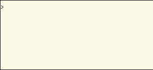

# Goodbye Hello World

Traditionally, the **`Hello World`** program is the first example offered as the
introduction to a programming language and does nothing more than output the
string "Hello World" to the output medium--generally the console. While adequate 
to demonstrate a particular language can actually do something, for anyone other 
than the novice programmer, a more thorough example is called for.

These code examples attempt to demonstrate basic capabilities of the languages
we will examine by expanding `Hello World` to include:  

- **Command Line Parameters**  
  Taking input criteria from the command line.

- **Prompted Input**  
  Prompting the user for input criteria.  

- **Input Validation**   
  Examination of input criteria against programmed limits.

- **Conditional Branching**  
  Altering the execute path based on conditions.

- **Iteration**  
  Repeated execution until a condition is met.

## Usage

`ghw [count]`

where: count = Number of iterations. User prompted of not supplied.

## Result

Counts down from `count` to `0`, pausing between each iteration, and prints each
count until complete.

  
   